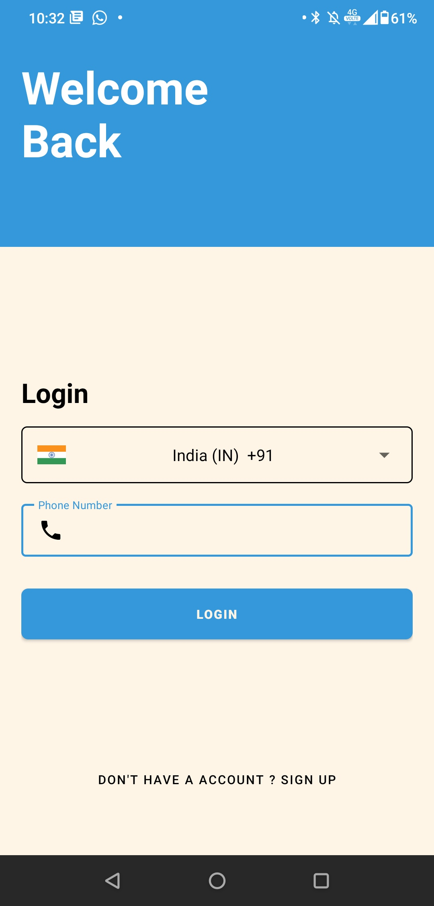
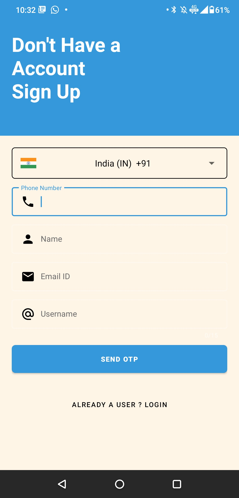
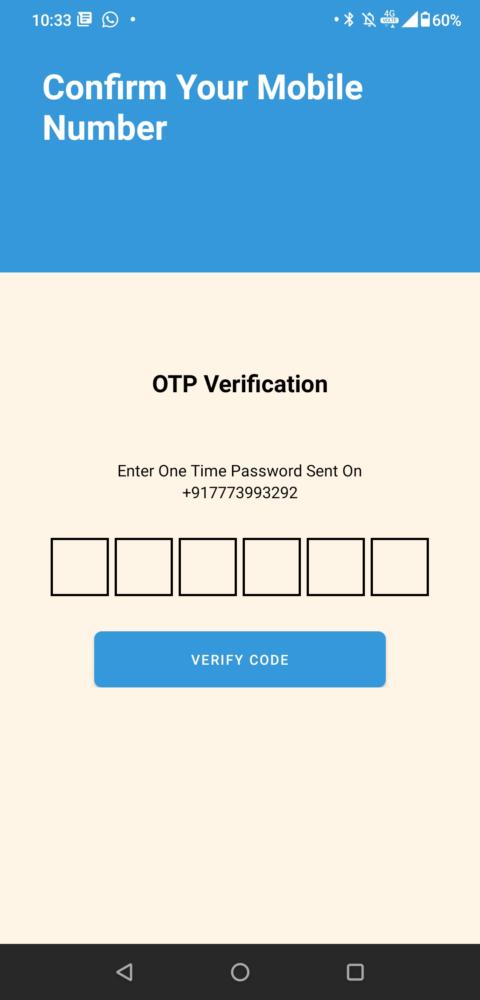

# Registration-app-android
* This is a Android App register and login templet which uses Firebase by Google for storing user data Mobile Authintication by Firebase

* It has 4 inputs for registration 1.Phone Number 2.Name 3.Email ID 4.User Name and uses Phone Number for Login 
On registration page App checks wether Phone Number/Email ID/User Name is already used if it is it shows error

* Login page has 2 inputs Country code picker and Phone Number
On login page it check wether user already present or not if the number entered is not used it redirects user to registration page

* On OTP authintication page app waits for OTP and automaticaly takes the OTP input user can also enter the OTP to complete the verification

# Sample Screenshots
<table>
  <tr>
    <td>Login Page</td>
     <td>Signup Page</td>
     <td>OTP Page</td>
  </tr>
 <tr>
 <td></td>
 <td></td>
 <td></td>
 </tr>
</table>

# Features
* Mobile Number for authintication

* OTP Verification

* Invalid Email ID error

* Invalid Phone Number Error

* Checks Email ID in database for Overlap

* Checks Phone Number in database for Overlap

* Checks Username in database for Overlap

* Redirects user to register page if number entered on login page does not exist in database

# Resource Used
* CountryCodePicker by hbb20
https://github.com/hbb20/CountryCodePickerProject

* Pinview by ChaosLeung
https://github.com/ChaosLeung/PinView

